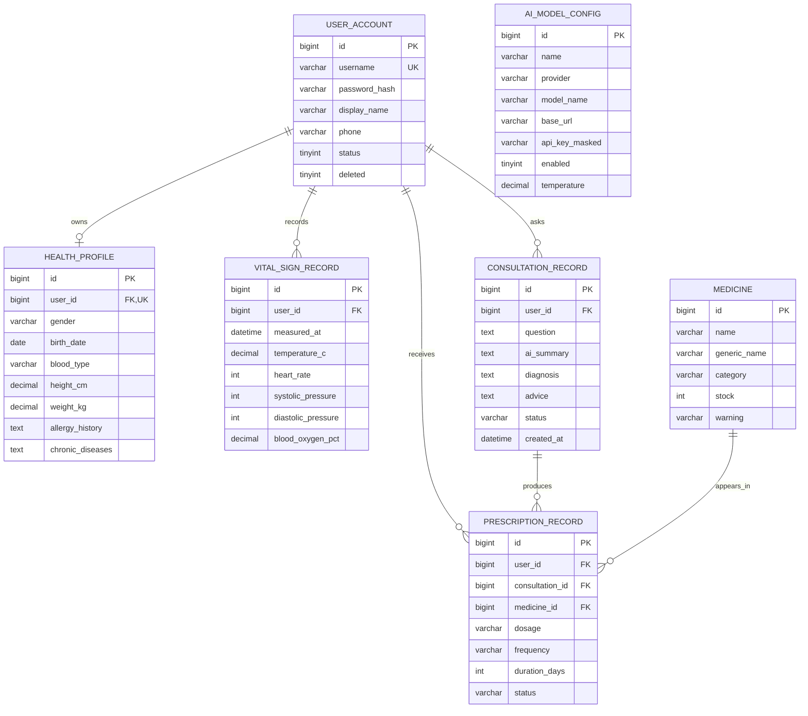

# DeepCare E-R 图

下图使用 Mermaid 表达逻辑模型，可在支持 Mermaid 的 Markdown 编辑器中预览。

```mermaid
erDiagram
    USER_ACCOUNT ||--o| HEALTH_PROFILE : owns
    USER_ACCOUNT ||--o{ VITAL_SIGN_RECORD : records
    USER_ACCOUNT ||--o{ CONSULTATION_RECORD : asks
    USER_ACCOUNT ||--o{ PRESCRIPTION_RECORD : receives
    CONSULTATION_RECORD ||--o{ PRESCRIPTION_RECORD : produces
    MEDICINE ||--o{ PRESCRIPTION_RECORD : appears_in

    USER_ACCOUNT {
        bigint id PK
        varchar username UK
        varchar password_hash
        varchar display_name
        varchar phone
        tinyint status
        tinyint deleted
    }
    HEALTH_PROFILE {
        bigint id PK
        bigint user_id FK,UK
        varchar gender
        date birth_date
        varchar blood_type
        decimal height_cm
        decimal weight_kg
        text allergy_history
        text chronic_diseases
    }
    VITAL_SIGN_RECORD {
        bigint id PK
        bigint user_id FK
        datetime measured_at
        decimal temperature_c
        int heart_rate
        int systolic_pressure
        int diastolic_pressure
        decimal blood_oxygen_pct
    }
    CONSULTATION_RECORD {
        bigint id PK
        bigint user_id FK
        text question
        text ai_summary
        text diagnosis
        text advice
        varchar status
        datetime created_at
    }
    MEDICINE {
        bigint id PK
        varchar name
        varchar generic_name
        varchar category
        int stock
        varchar warning
    }
    PRESCRIPTION_RECORD {
        bigint id PK
        bigint user_id FK
        bigint consultation_id FK
        bigint medicine_id FK
        varchar dosage
        varchar frequency
        int duration_days
        varchar status
    }
    AI_MODEL_CONFIG {
        bigint id PK
        varchar name
        varchar provider
        varchar model_name
        varchar base_url
        varchar api_key_masked
        tinyint enabled
        decimal temperature
    }
```

`AI_MODEL_CONFIG` 是平台配置实体，不直接关联用户业务数据；问诊服务在运行时读取启用的模型配置。
